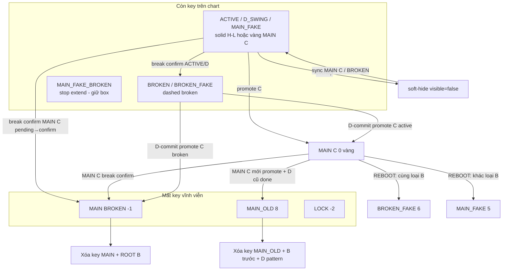

# Loop 6 — Mối quan hệ Keylevel box: FAKE / BROKEN / MAIN C

Tài liệu mô tả **ai giữ key**, **style nào**, và **xóa / soft-hide / recreate** khi cấu trúc chuyển trạng thái — khớp Pine `f_sync_keybox_with_flag`, `process_break`, `f_push` (D-commit), `f_handle_main_c_after_promote`.

**C#:** `KeyLevelSyncEngine`, `PivotTransitionEngine`, `MainPromotionEngine`, `KeyLevelOverlapEngine`, `KeyLevelDrawEngine`.

---

## 1. Chuỗi pivot điển hình

```
... → B (BROKEN, flag=2) → C (ACTIVE/BROKEN) → D (D_SWING, flag=4) → ...
                              ↓ promote
                         MAIN C (flag=0) hoặc MAIN BROKEN (flag=-1)
```

| Vai trò | Flag thường gặp | Keylevel mặc định |
|---------|-----------------|-------------------|
| **B** — swing bị break, chờ D | `2` BROKEN | Có key (nếu `hasKey`), **dashed broken** |
| **C** — candidate MAIN | `1` ACTIVE hoặc `2` BROKEN | ACTIVE style hoặc broken; sau promote → vàng MAIN C hoặc **xóa** (MAIN BROKEN) |
| **D** — D_SWING sau MAIN C | `4` | ACTIVE style; gắn `mainDIdx` của MAIN C |
| **FAKE** giữa B–D | `5` MAIN_FAKE / `6` BROKEN_FAKE | Phụ thuộc **ROOT B** (`keyGroupId`) |
| **MAIN C cũ** | `8` MAIN_OLD | **Không key vĩnh viễn** (`hasKey=false`) |

---

## 2. Bảng flag → hành vi key (`f_sync_keybox_with_flag`)

| Flag | Tên | `allowKey` | Style / hành động | Ghi chú |
|------|-----|------------|---------------------|---------|
| `1` | ACTIVE | `hasKey` | H/L fill, solid | Có thể bị **soft-hide** (overlap) |
| `0` | MAIN C (`mainRole=1`) | `hasKey` | **Vàng solid** (`EmitUpdateKeyBoxMainC`) | `allowCreate` kể cả khi `visible=false` (recreate sau soft-hide) |
| `2` | BROKEN | `hasKey` | Broken invert + **dashed** | `allowCreate` kể cả soft-hide → sync ngay khi break confirm |
| `6` | BROKEN FAKE | `hasKey` + group OK | Giống BROKEN | Mất key nếu ROOT B (`keyGroupId`) mất `hasKey` |
| `4` | D_SWING | `hasKey` + group OK | Giống ACTIVE | Cùng rule group với FAKE |
| `5` | MAIN FAKE | `hasKey` + group OK | Giống ACTIVE | `keyGroupId` → pivot B ROOT |
| `50` | MAIN FAKE PENDING | (pending) | Chưa đổi style đến khi confirm/rollback | |
| `-3` | MAIN_FAKE_BROKEN | `hasKey` | **Stop extend** tại bar break; **không xóa box** | Khác MAIN BROKEN |
| `-1` | MAIN BROKEN | **false** | **Xóa key + OB** | `firstDIdx = waiting` |
| `-2` | LOCK | **false** | **Xóa key + OB** (kể FAKE chỉ xóa key, flag FAKE giữ) | |
| `8` | MAIN_OLD | **false** | **Xóa key vĩnh viễn**, `hasKey=false` | Không recreate |
| `3`,`7` | PENDING break | Theo `originalFlag` | Chưa confirm → style cũ | Rollback → `f_sync` lại |

**Soft-hide (overlap):** `KeyLevelOverlapEngine` → `EmitSoftHideKeyBox`: xóa chart box, `keyVisible=false`, **`hasKey` vẫn true**. MAIN C / BROKEN có thể **hiện lại** qua `f_sync` khi `allowCreate`.

**FAKE / D_SWING phụ thuộc ROOT B:**

```
if pivKeyGroupId[x] = j và pivHasKey[j] = false
  → pivHasKey[x] = false, không vẽ key FAKE/D
```

---

## 3. Sơ đồ quan hệ theo sự kiện



---

## 4. MAIN C → MAIN BROKEN (break confirm, `originalFlag == 0`)

**Kích hoạt:** `process_break` confirm trên swing đang **MAIN C** (`flag` was `0`, pending `3`).

| Đối tượng | Trước | Sau | Keylevel |
|-----------|-------|-----|----------|
| **MAIN C** (index `i`) | flag `0`, key vàng | flag `-1` | **Xóa** key + OB của `i` |
| **ROOT B** (`i-1`, flag `2`, cùng `structId`) | BROKEN, có key | giữ flag `2` | **Xóa** key B (`f_cleanup_broken_B_and_root_of_main`) |
| **D đã commit** (nếu có) | linked | reset → ACTIVE `1` | D giữ/recreate key ACTIVE khi sync |
| **MAIN C** | — | `firstDIdx = waiting` | Chờ D mới để promote C lần sau |

**Không** áp dụng lock swing tại đây (Pine: MAIN BROKEN NO LOCK).

**C#:** `PivotTransitionEngine` nhánh `origFlag == 0` → `EmitDelKeyBox(i)` + `CleanupBrokenBAndRootOfMain`.

---

## 5. MAIN C → MAIN OLD

Có **hai trigger** độc lập, cùng cleanup logic:

### 5a. Promote-time sweep (`f_handle_main_c_after_promote`)

**Kích hoạt:** Sau khi **MAIN C mới (Z)** được promote, quét mọi MAIN C **cùng loại** còn `flag=0`.

**Điều kiện MAIN C cũ chết → MAIN_OLD:**
- Không có `mainDIdx`, **hoặc**
- D_SWING liên kết có `firstDIdx == Done (-2)` (pivot B trong cấu trúc D đã xong)

### 5b. D_swing broken done (`f_handle_main_c_for_broken_d_done` / `DemoteMainCsForBrokenDSwing`)

**Kích hoạt:** Khi D_swing X đạt **broken done**, quét mọi MAIN C `flag=0` có `mainDIdx == X`.

**Flag của D khi broken done: `2` (BROKEN)** — phân biệt với broken waiting bằng `firstDIdx`:

| Trạng thái D | flag | firstDIdx | Trigger 5b? |
|---|---|---|---|
| D_SWING active | `4` | link B `j` | Không |
| Broken waiting D | `2` | `-1` | **Không** |
| **Broken done — Path A** | `2` | `-2` (Done) | **Có** — sau `f_push`/`TryCommitD` |
| **Broken done — Path B** | `2` | `j` (NOT isRootB, B đã Done) | **Có** — ngay break confirm |

**Hook points (C# + Pine):**
- **Path B (C#):** `PineStateEngine` post-`Transitions.Tick`: `flagBeforePending==4`, `flag→2`, `firstDIdx != -1`
- **Path A (C#):** `TryCommitD` `MarkBDoneAndDemote(j)` sau mỗi `SetFirstDIdx(j, Done)`
- **Path B (Pine):** `process_break` D_SWING BROKEN confirm: `array.get(pivFirstDIdx, i) != -1`
- **Path A (Pine):** `f_push` sau mỗi `array.set(pivFirstDIdx, j, -2)`

---

**Cleanup giống nhau cho cả 5a và 5b:**

| Đối tượng | Sau | Keylevel |
|-----------|-----|----------|
| **MAIN C cũ** | flag `8` MAIN_OLD | **Xóa** key, `hasKey=false`, xóa OB (trừ H4) |
| **B ngay trước** (`i-1`) | thường vẫn BROKEN | **Xóa** key B |
| **D_SWING** tại `d` nếu `pivFlag[d+2]==8` | flag `4` giữ | **Chỉ xóa** key D (không đổi flag D) |

**Quan hệ nhãn:** MAIN_OLD chỉ còn label xám; **không** có key box trên chart.

---

## 6. Promote C sau D-commit (MAIN C mới vs MAIN BROKEN)

**Kích hoạt:** `f_push` / `MainPromotionEngine.TryCommitD` khi B broken chờ D gặp D mới hợp lệ.

### 6a. C là ACTIVE → MAIN C (`newFlag = 0`)

| Đối tượng | Keylevel |
|-----------|----------|
| **C** | `EmitUpdateKeyBoxMainC` — vàng, recreate nếu soft-hide |
| **B** (`j`) | `firstDIdx = Done`; B vẫn BROKEN — key B thường vẫn (broken) cho đến MAIN_OLD sweep |
| **Giữa B–D** (REBOOT) | Cùng loại B → `6` BROKEN_FAKE + **broken style**; khác loại → `5` MAIN_FAKE + **active style** |

### 6b. C là BROKEN → MAIN BROKEN (`newFlag = -1`)

| Đối tượng | Keylevel |
|-----------|----------|
| **C** (MAIN BROKEN mới) | **Xóa** key C + OB |
| **B** (`j`) | **Xóa** key B (promote từ broken) |
| **ROOT B** của C | **Xóa** (`DeleteRootBKey`) |
| **D của C** (nếu C từng chờ D) | reset ACTIVE `1` |

Sau đó gọi `HandleMainCAfterPromote` → các MAIN C cũ cùng loại có thể → **MAIN_OLD** (mục 5).

### 6c. C đã là MAIN C (`cFlag == 0`) — D commit nhưng C invalid

Chỉ **B → BROKEN** + sync broken; **không** promote; key C MAIN giữ.

---

## 7. Stop extend — bar index (Pine `time` vs cTrader `Time2`)

Pine `box.set_right(t)` đặt cạnh phải tại **open** của bar `t`. cTrader `ChartRectangle.Time2` tại open đó vẫn **bao trọn cả nến** → chart lùi **1 bar** (`KeyLevelVisual.ToChartRightBarIndex` trong host `StopExtendKeyBox`).

| Loại box | Pine cạnh phải | Bar index gửi lệnh (Core) | Chart `Time2` (host) | Nến phá / đóng cửa |
|----------|----------------|---------------------------|----------------------|---------------------|
| **MAIN_FAKE_BROKEN** | `time[bar_index - breakBar]` tại bar confirm | `pivBreakBar` (latch = `bar_index` lúc B) | `breakBar - 1` | B = `breakBar - 1` (calc bar) |
| **BROKEN / BROKEN_FAKE key-break** | `time` = `bar_index` | `bar_index` (OHLC **offset 0**, không `closeUsed[1]`) | `bar_index - 1` | Cùng bar đóng cửa phá key |
| **OB ZIN→LOSE** | `time[1]` tại `bar_index` | `bar_index - 1` (đã −1 trong engine) | **không** −1 thêm | Nến LOSE = calc `bar_index-1` |
| **OB LTF reject** | `box.delete` (Pine) | `DelObBox` hoặc stop tại `obBar` | — | Khác Pine |

**`pivBreakBar`:** lưu `bar_index` khi latch B (B thực = `bar_index - 1`). Confirm tại `bar_index + 1`: Pine `lag = 1` → `time[1]` = open(`breakBar`) — khớp nến B đóng cửa trên TV.

**`pivKeyStopBar`:** `bar_index` lúc stop (Event C: `keyStopBar == bar_index`).

### Flag / swing (hành vi)

| Flag | Stop khi | Extend trước đó |
|------|----------|-----------------|
| **5 / 50 MAIN_FAKE** | Không (đến confirm) | `extend.right` |
| **5 → -3** | Break confirm | Dừng tại B (bảng trên) |
| **6 BROKEN_FAKE** | Key-break (flag 2/6) | Vẫn extend sau REBOOT |
| **2 BROKEN** | Key-break | Dashed + extend đến khi phá key |

### C# (đã chỉnh)

| Pine | C# |
|------|-----|
| `f_check_key_*` `close`/`open` bar_index | `KeyLevelDrawEngine` dùng `ohlc0` |
| `f_stop_key_extension` | `EmitStopExtendKeyBox` + host `ToChartRightBarIndex` |
| MAIN_FAKE ~3527–3538 | `EmitStopExtendKeyBox(..., breakBar, true)` |
| OB LOSE `time[1]` | `stopBar = barIndex - 1` — **không** qua `ToChartRightBarIndex` |

---

## 8. BROKEN / FAKE — quan hệ với MAIN C (không promote)

| Swing | Khi break confirm | Key của chính nó | Key ROOT B (`i-1`) |
|-------|-------------------|------------------|---------------------|
| **ACTIVE** → BROKEN | `f_sync` → dashed | Giữ (broken style) | — |
| **D_SWING** → BROKEN | dashed | Giữ | — |
| **MAIN_FAKE** → MAIN_FAKE_BROKEN | **Stop extend**, giữ box | Giữ | **Xóa** ROOT B key |
| **BROKEN_FAKE** | đã broken | dashed | Phụ thuộc group |

**MAIN C** không đi qua nhánh BROKEN dashed — đi thẳng **xóa key** (mục 4).

---

## 9. Ma trận tóm tắt: ai ảnh hưởng key của ai

| Sự kiện | MAIN C (0) | MAIN BROKEN (-1) | MAIN_OLD (8) | BROKEN B (2) | BROKEN_FAKE (6) | MAIN_FAKE (5) | D_SWING (4) |
|---------|------------|------------------|--------------|--------------|-----------------|---------------|-------------|
| MAIN C break → MAIN BROKEN | **Xóa** | tạo (-1) | — | **Xóa** nếu ROOT B | — | — | reset ACTIVE |
| MAIN C mới promote | giữ vàng | — | cũ → **8, xóa** | **Xóa** B trước OLD | reboot → 6 | reboot → 5 | có thể **xóa** nếu `d+2=8` |
| Promote C broken → MAIN BROKEN | — | **Xóa** C,B | — | **Xóa** j | — | — | — |
| Lock swing | — | — | — | **Xóa** (cả FAKE key) | **Xóa** key | **Xóa** key | **Xóa** key |
| Overlap soft-hide | có thể hide | — | — | có thể hide | có thể hide | có thể hide | có thể hide |
| ROOT B mất `hasKey` | — | — | — | — | **mất key** | **mất key** | **mất key** |

---

## 10. Thứ tự xử lý mỗi bar (C#)

1. `process_break` — confirm/rollback → có thể xóa MAIN key hoặc sync BROKEN  
2. Push pivot mới + key tạo lúc push  
3. `TryCommitD` — promote + lock + **HandleMainCAfterPromote**  
4. OB / RealZone  
5. `KeyLevelDrawEngine.Tick` — extend, break-stop, overlap soft-hide, **`SyncKeyboxWithFlag`** mọi pivot đổi flag  
6. `PineStateEngine.SyncKeyboxesOnBrokenFlagTransition` — ACTIVE/D → BROKEN ngay khi transition  

---

## 11. Đọc nhanh trên chart

| Bạn thấy | Ý nghĩa key |
|----------|-------------|
| Vàng solid | **MAIN C đang hiệu lực** (hoặc recreate sau hide) |
| H/L solid | ACTIVE, D_SWING, MAIN_FAKE (còn group) |
| Dashed muted | BROKEN / BROKEN_FAKE |
| Không box, label MAIN BROKEN | MAIN C vừa gãy — chờ D mới |
| Không box, label MAIN_OLD | MAIN C cũ — cấu trúc đã thay; thường B trước cũng mất key |
| Box dừng extend (FAKE) | MAIN_FAKE_BROKEN — key không xóa |

---

## Tham chiếu Pine (dòng chính)

| Logic | Pine | C# |
|-------|------|-----|
| Sync style | `f_sync_keybox_with_flag` ~1575 | `KeyLevelSyncEngine` |
| MAIN → MAIN BROKEN | `process_break` ~3478 | `PivotTransitionEngine` |
| MAIN C → MAIN_OLD | `f_handle_main_c_after_promote` ~2855 | `MainPromotionEngine.HandleMainCAfterPromote` |
| Promote C | `f_push` ~4159 | `MainPromotionEngine.TryCommitD` |
| Overlap hide | `f_limit_overlapping_key_boxes` | `KeyLevelOverlapEngine` |

Xem thêm: [Loop6_OB_Keylevel_Mapping.md](./Loop6_OB_Keylevel_Mapping.md).

---

## Pine ↔ C# parity (đã sửa)

| Gap (trước đây) | Pine | C# sau sửa |
|-----------------|------|------------|
| Không cascade `f_delete_keylevel` | 1477–1491 | `KeyLevelMaintenance.DeleteKeylevel` |
| Lock set `hasKey=false` | 2963–2966 chỉ xóa box | `DeleteKeyBoxOnLock` giữ `hasKey` |
| `f_sync` / MAIN_OLD thiếu xóa OB | 1614–1620, 2907 | `SyncKeyboxWithFlag` + `HandleMainCAfterPromote` + `obPool` |
| ROOT B thiếu check `structId` | 1517–1522 | `DeleteRootBKeyOfMain` |
| Lookback = pool trim + display (không gate break) | trim ~4428, f_push ~3840, `is_pivot_visible` | `PivotTrimEngine` + push filter; label/OB draw |
| Lock sau D-commit | `lockSwingCount` + `f_lock_swings_before` | `LockSwingsBefore` + `LockSwingCount` (default 50) |
| D-commit dùng `EmitUpdate*` thay `f_sync` | 4067, 4171, 4257 | `SyncKeyboxWithFlag` khi có `keyCtx` |
| D timing fail reset B/D sai | không có nhánh | bỏ `MarkBTimingMismatchDone`, `continue` |
| Không C → thiếu `f_delete_keylevel(j)` | 4044 | `DeleteKeylevel(j)` |
| H4 skip OB delete | `timeframe != "240"` | `IsH4Chart` |
| `update_label` lock → xóa OB | 2994–2995 | `PivotLabelEngine` + `ObPool` |

**Còn MINOR (visual/host):** `inpShowKeyBorder`, dim line MAIN_OLD, `keylevelUseAtrRule` input host.
